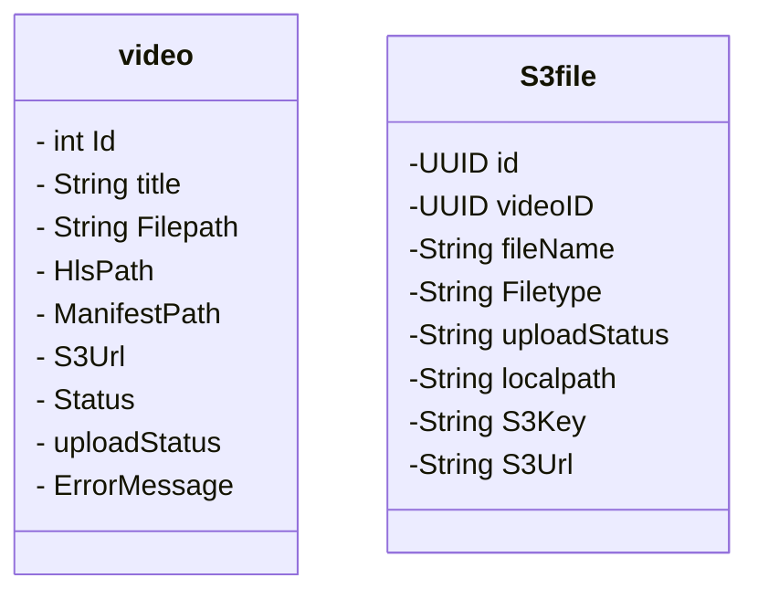
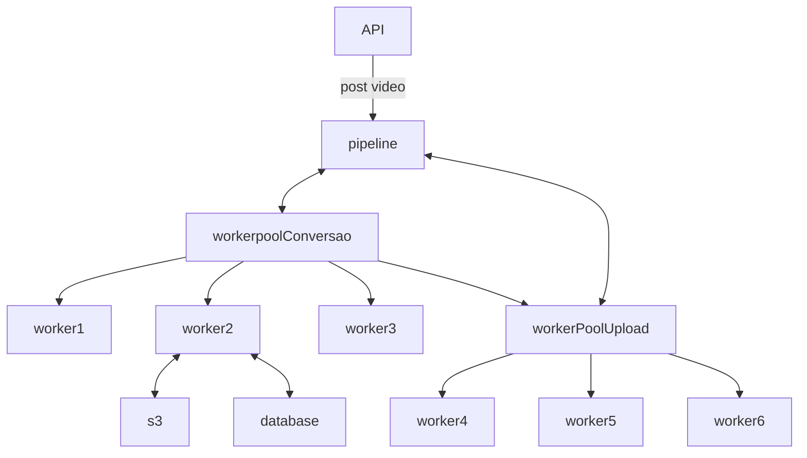

# projeto com golang para dfazer upload de videos no s3 de forma assincrona

## dominio da aplicação

```mermaid
classDiagram
    class video {
        - int Id
        - String title
        - String Filepath
        - HlsPath
        - ManifestPath
        - S3Url
        - Status
        - uploadStatus
        - ErrorMessage
    }
    
    class S3file{
      -UUID id 
      -UUID videoID
      -String fileName
      -String Filetype
      -String uploadStatus
      -String localpath
      -String S3Key
      -String S3Url
    }
 %%  video <|-- S3file

```

## System desing do sistema

```mermaid
flowchart TD
    A[API] -->|post video| pipeline
    pipeline <--> workerpoolConversao
    pipeline <--> workerPoolUpload
    workerpoolConversao --> worker1
    workerpoolConversao --> worker2
    worker2 <--> s3
    worker2 <--> database
    workerpoolConversao --> worker3
    workerpoolConversao --> workerPoolUpload

    workerPoolUpload --> worker4
    workerPoolUpload --> worker5
    workerPoolUpload --> worker6
```