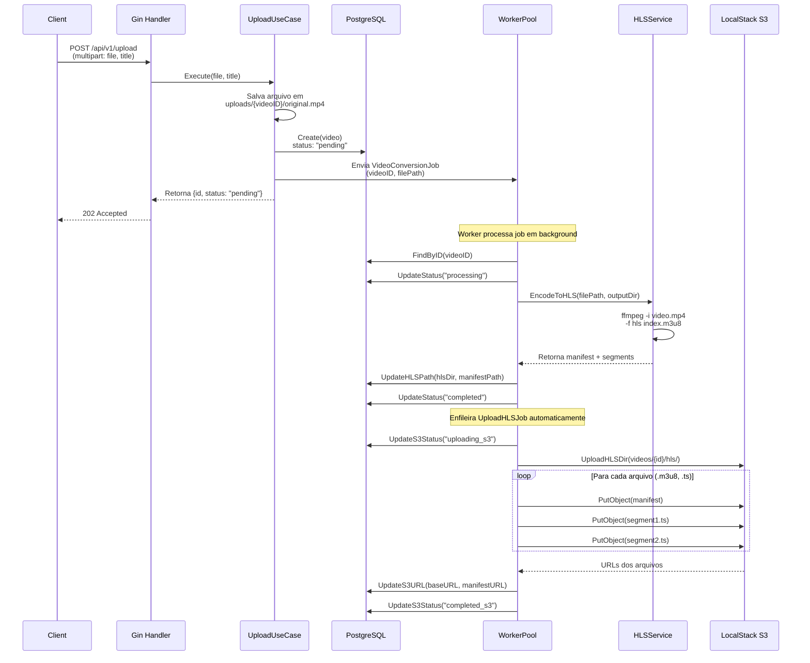
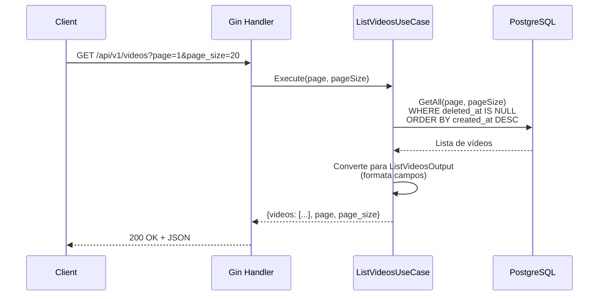
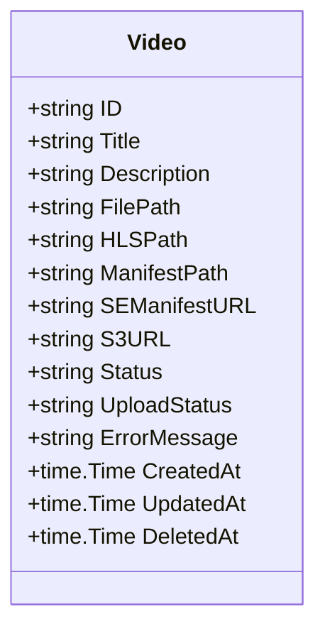

# MiniYouTube - Upload e Conversão de Vídeos HLS

Sistema de upload e conversão assíncrona de vídeos para HLS com armazenamento em S3, utilizando worker pool para processamento paralelo.

## 📋 Índice

- [Estrutura de Pastas](#estrutura-de-pastas)
- [Como Rodar](#como-rodar)
- [Como Rodar com Docker](#como-rodar-com-docker)
- [Fluxo de Upload](#fluxo-de-upload)
- [Fluxo de Listagem](#fluxo-de-listagem)
- [Domínio da Aplicação](#domínio-da-aplicação)

## 📁 Estrutura de Pastas

```
minityoutube/
├── cmd/
│   └── main.go                    # Ponto de entrada da aplicação
├── internal/
│   ├── config/                    # Composição e inicialização (bootstrap)
│   │   ├── config.go              # Configuração da aplicação
│   │   └── bootstrap.go           # Montagem de dependências (DB, S3, worker pool, rotas)
│   ├── application/               # Casos de uso (regras de negócio)
│   │   └── usecase/
│   │       ├── upload_video.go           # Upload de vídeo
│   │       ├── video_conversion_job.go   # Conversão HLS e upload S3
│   │       └── list_videos.go            # Listagem paginada
│   ├── domain/                    # Entidades e interfaces (DDD)
│   │   ├── entity/
│   │   │   └── video.go           # Entidade Video
│   │   └── repository/
│   │       └── video.repository.go # Interface do repositório
│   └── infra/                     # Implementações de infraestrutura
│       ├── database/
│       │   ├── db.go              # Conexão PostgreSQL e migrations
│       │   └── migrations/        # SQL migrations (golang-migrate)
│       ├── database/repository/
│       │   └── postgres/
│       │       └── video_repository.go # Implementação PostgreSQL
│       ├── gateway/               # Gateways para recursos externos
│       │   ├── hls/               # Gateway HLS (ffmpeg)
│       │   │   ├── service.go     # Wrapper do ffmpeg para conversão HLS
│       │   │   └── types.go       # Tipos HLS (manifest, segment, options)
│       │   └── storage/
│       │       └── s3/
│       │           └── client.go  # Cliente S3 (LocalStack/AWS)
│       └── http/
│           └── gin/
│               ├── router.go      # Rotas da API
│               └── handlers/      # Handlers HTTP
├── pkg/                           # Pacotes compartilhados
│   ├── workerpool/                # Worker pool genérico
│   └── env.go                     # Helpers de ambiente
├── docker-compose.yaml            # Orquestração (PostgreSQL + LocalStack)
├── Dockerfile                     # Build da aplicação
├── .env.example                   # Exemplo de variáveis de ambiente
├── Makefile                       # Comandos úteis (dev, run, build)
└── README.md                      # Esta documentação
```

### 📦 Organização por Camadas (DDD)

- **`cmd/`** - Ponto de entrada da aplicação
- **`internal/config/`** - Bootstrap e composição de dependências (equivalente a "módulos" do NestJS)
- **`internal/application/`** - Casos de uso (regras de negócio, orquestração)
- **`internal/domain/`** - Entidades e interfaces (contratos, sem implementação)
- **`internal/infra/`** - Implementações técnicas:
  - **`database/`** - Conexão e migrations do PostgreSQL
  - **`database/repository/`** - Implementações concretas dos repositórios
  - **`gateway/`** - Integrações com recursos externos:
    - **`hls/`** - Conversão de vídeo via ffmpeg
    - **`storage/s3/`** - Armazenamento em S3 (LocalStack/AWS)
    - *(Futuro: `email/`, `sms/`, `payment/`, etc.)*
  - **`http/`** - Camada HTTP (Gin, handlers, rotas)
- **`pkg/`** - Pacotes reutilizáveis (worker pool, helpers)

### 🔌 Gateway Pattern

O diretório **`internal/infra/gateway/`** concentra todas as integrações com recursos externos seguindo o padrão **Gateway**:

- **`gateway/hls/`** - Conversão de vídeo para HLS usando ffmpeg
- **`gateway/storage/s3/`** - Armazenamento em S3 (LocalStack para dev, AWS para produção)
- *(Futuro: `gateway/email/`, `gateway/sms/`, `gateway/payment/`, etc.)*

**Por que Gateway?**
- Isola a comunicação com serviços externos
- Facilita testes (mock de gateways)
- Permite trocar implementações sem afetar o domínio
- Centraliza configurações e tratamento de erros de integração

## 🚀 Como Rodar

### Pré-requisitos

- Go 1.24+
- PostgreSQL 15+ (ou via Docker)
- ffmpeg instalado
- LocalStack (S3 local) ou Docker Compose

### Passo a passo

1. **Clone o repositório e instale dependências:**

```bash
git clone <repo-url>
cd minityoutube
go mod download
```

2. **Configure as variáveis de ambiente:**

Copie `.env.example` para `.env` e ajuste:

```bash
cp .env.example .env
```

Edite `.env`:

```env
# Database
DB_HOST=localhost
DB_PORT=5432
DB_USER=postgres
DB_PASSWORD=postgres
DB_NAME=postgres

# S3 (LocalStack)
S3_BUCKET=videos
S3_ENDPOINT=http://localhost:4566
AWS_REGION=us-east-1
AWS_ACCESS_KEY_ID=test
AWS_SECRET_ACCESS_KEY=test

# App
PORT=8080
WORKER_COUNT=4
UPLOAD_DIR=./uploads
```

3. **Inicie PostgreSQL e LocalStack:**

```bash
docker compose up -d db localstack
```

4. **Crie o bucket S3 no LocalStack:**

```bash
aws --endpoint-url=http://localhost:4566 s3 mb s3://videos
```

5. **Execute a aplicação:**

```bash
# Modo desenvolvimento (com debugger Delve)
make dev

# Ou modo produção (sem debugger)
make run

# Ou diretamente
go run ./cmd
```

A aplicação estará disponível em `http://localhost:8080`.

## 🐳 Como Rodar com Docker

### Opção 1: Docker Compose (recomendado)

1. **Configure o `.env`** (veja seção anterior)

2. **Suba todos os serviços:**

```bash
docker compose up -d
```

Isso inicia:
- **PostgreSQL** na porta `5432`
- **LocalStack (S3)** na porta `4566`
- **Aplicação** na porta `8080`

3. **Verifique os logs:**

```bash
docker compose logs -f app
```

4. **Para parar:**

```bash
docker compose down
```

### Opção 2: Build manual

```bash
# Build da imagem
docker build -t miniyoutube .

# Execute com docker run (configure variáveis de ambiente)
docker run -p 8080:8080 \
  -e DB_HOST=host.docker.internal \
  -e S3_ENDPOINT=http://host.docker.internal:4566 \
  miniyoutube
```

## 📤 Fluxo de Upload



### Detalhamento

1. **Cliente envia vídeo** via `POST /api/v1/upload` (multipart/form-data)
2. **Handler** extrai arquivo e título, chama `UploadVideoUseCase`
3. **Use Case**:
   - Salva o arquivo em `uploads/{videoID}/original.{ext}`
   - Cria registro no banco com `status: "pending"`
   - Envia `VideoConversionJob` para o worker pool
   - Retorna **202 Accepted** imediatamente
4. **Worker Pool** (background):
   - **Conversão HLS**: busca vídeo, atualiza status para `"processing"`, chama `ffmpeg` para gerar HLS (manifest `.m3u8` + segmentos `.ts`), atualiza `HLSPath` e status para `"completed"`
   - **Upload S3**: enfileira `UploadHLSJob`, faz upload paralelo de todos os arquivos HLS para S3 (`videos/{videoID}/hls/`), atualiza `S3URL` e `upload_status: "completed_s3"`

## 📋 Fluxo de Listagem



### Detalhamento

1. **Cliente** faz `GET /api/v1/videos?page=1&page_size=20`
2. **Handler** extrai query params (`page`, `page_size`), chama `ListVideosUseCase`
3. **Use Case**:
   - Valida paginação (default: page=1, page_size=20, max=100)
   - Chama `repository.GetAll(ctx, page, pageSize)`
   - Converte entidades para DTOs (`ListVideosOutput`)
4. **Resposta JSON**:
```json
{
  "videos": [
    {
      "id": "uuid",
      "title": "Meu Vídeo",
      "status": "completed",
      "upload_status": "completed_s3",
      "s3_url": "http://localhost:4566/videos/{id}/hls",
      "se_manifest_url": "http://localhost:4566/videos/{id}/hls/index.m3u8",
      "created_at": "2026-02-18T15:30:00Z"
    }
  ],
  "page": 1,
  "page_size": 20
}
```

## 🏗️ Domínio da Aplicação

### Entidade Video



### Status do Vídeo

- **Status** (processamento HLS):
  - `pending` → `processing` → `completed` / `failed`

- **UploadStatus** (upload S3):
  - `pending_s3` → `uploading_s3` → `completed_s3` / `failed_s3`

### Arquitetura do Sistema

```mermaid
flowchart TD
    A[API Gin] -->|POST /upload| B[UploadUseCase]
    B -->|Salva arquivo| C[Disco Local]
    B -->|Cria registro| D[(PostgreSQL)]
    B -->|Enfileira job| E[WorkerPool]
    
    E -->|VideoConversionJob| F[Worker 1]
    E -->|VideoConversionJob| G[Worker 2]
    E -->|VideoConversionJob| H[Worker N]
    
    F -->|Converte HLS| I[ffmpeg]
    I -->|Gera arquivos| J[uploads/{id}/hls/]
    F -->|Enfileira| K[UploadHLSJob]
    
    K -->|Upload paralelo| L[S3 LocalStack]
    F -->|Atualiza DB| D
    
    A -->|GET /videos| M[ListVideosUseCase]
    M -->|Consulta| D
    M -->|Retorna JSON| A
```

## 🔧 Variáveis de Ambiente

| Variável | Descrição | Padrão |
|----------|-----------|--------|
| `DB_HOST` | Host do PostgreSQL | `localhost` |
| `DB_PORT` | Porta do PostgreSQL | `5432` |
| `DB_USER` | Usuário do banco | `postgres` |
| `DB_PASSWORD` | Senha do banco | `postgres` |
| `DB_NAME` | Nome do banco | `postgres` |
| `S3_BUCKET` | Nome do bucket S3 | `videos` |
| `S3_ENDPOINT` | Endpoint do LocalStack | `http://localhost:4566` |
| `AWS_REGION` | Região AWS | `us-east-1` |
| `AWS_ACCESS_KEY_ID` | Access key (LocalStack) | `test` |
| `AWS_SECRET_ACCESS_KEY` | Secret key (LocalStack) | `test` |
| `PORT` | Porta da API | `:8080` |
| `WORKER_COUNT` | Número de workers | `4` |
| `UPLOAD_DIR` | Diretório de uploads | `./uploads` |

## 📝 Endpoints da API

### POST /api/v1/upload

Upload de vídeo (multipart/form-data).

**Campos:**
- `file` (obrigatório): arquivo de vídeo
- `title` (opcional): título do vídeo

**Resposta (202 Accepted):**
```json
{
  "id": "uuid-do-video",
  "status": "pending",
  "file_path": "./uploads/{id}/original.mp4"
}
```

### GET /api/v1/videos

Lista vídeos com paginação.

**Query params:**
- `page` (opcional, default: 1)
- `page_size` (opcional, default: 20, max: 100)

**Resposta (200 OK):**
```json
{
  "videos": [
    {
      "id": "uuid",
      "title": "Meu Vídeo",
      "description": "",
      "status": "completed",
      "upload_status": "completed_s3",
      "s3_url": "http://localhost:4566/videos/{id}/hls",
      "se_manifest_url": "http://localhost:4566/videos/{id}/hls/index.m3u8",
      "created_at": "2026-02-18T15:30:00Z"
    }
  ],
  "page": 1,
  "page_size": 20
}
```

## 🛠️ Comandos Úteis

```bash
# Desenvolvimento (com debugger)
make dev

# Executar sem debugger
make run

# Compilar binário
make build

# Verificar S3 (LocalStack)
aws --endpoint-url=http://localhost:4566 s3 ls

# Criar bucket
aws --endpoint-url=http://localhost:4566 s3 mb s3://videos

# Verificar saúde do LocalStack
curl http://localhost:4566/_localstack/health
```

## 📚 Tecnologias

- **Go 1.24+**
- **Gin** - Framework HTTP
- **PostgreSQL** - Banco de dados
- **golang-migrate** - Migrations
- **LocalStack** - S3 local para desenvolvimento
- **AWS SDK Go v2** - Cliente S3
- **ffmpeg** - Conversão de vídeo para HLS
- **Worker Pool** - Processamento assíncrono paralelo
