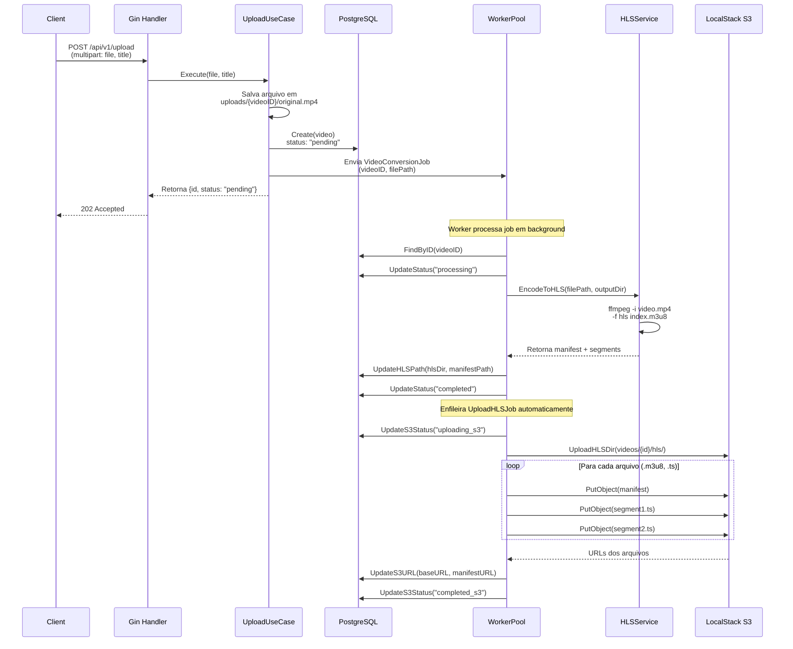
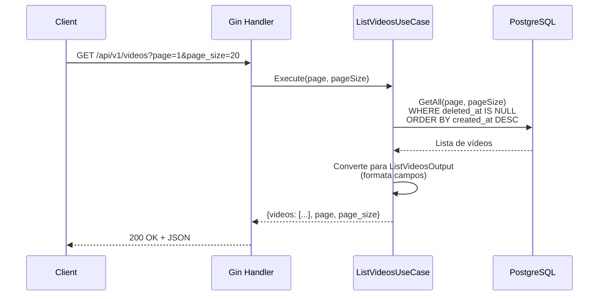

# Endpoints da API

Base URL: `http://localhost:8080`

---

## POST /api/v1/upload

Upload de vídeo para conversão assíncrona.

**Content-Type:** `multipart/form-data`

**Campos:**

| Campo | Tipo | Obrigatório | Descrição |
|-------|------|-------------|-----------|
| `file` | arquivo | Sim | Arquivo de vídeo (mp4, mkv, etc.) |
| `title` | string | Não | Título do vídeo |

**Exemplo:**

```bash
curl -X POST http://localhost:8080/api/v1/upload \
  -F "file=@/caminho/para/video.mp4" \
  -F "title=Meu Vídeo"
```

**Resposta (202 Accepted):**

```json
{
  "id": "550e8400-e29b-41d4-a716-446655440000",
  "status": "pending",
  "file_path": "./uploads/550e8400/original.mp4"
}
```

O processamento ocorre em background. Use o endpoint de listagem para acompanhar o status.

---

## GET /api/v1/videos

Lista vídeos com paginação.

**Query params:**

| Parâmetro | Tipo | Padrão | Descrição |
|-----------|------|--------|-----------|
| `page` | int | `1` | Número da página |
| `page_size` | int | `20` | Itens por página (máx: 100) |

**Exemplo:**

```bash
curl "http://localhost:8080/api/v1/videos?page=1&page_size=10"
```

**Resposta (200 OK):**

```json
{
  "videos": [
    {
      "id": "550e8400-e29b-41d4-a716-446655440000",
      "title": "Meu Vídeo",
      "description": "",
      "status": "completed",
      "upload_status": "completed_s3",
      "s3_url": "http://localhost:4566/videos/550e8400/hls",
      "se_manifest_url": "http://localhost:4566/videos/550e8400/hls/index.m3u8",
      "created_at": "2026-02-18T15:30:00Z"
    }
  ],
  "page": 1,
  "page_size": 10
}
```

---

## Fluxo de Upload



### Detalhamento

1. **Cliente envia vídeo** via `POST /api/v1/upload` (multipart/form-data)
2. **Handler** extrai arquivo e título, chama `UploadVideoUseCase`
3. **Use Case**:
   - Salva o arquivo em `uploads/{videoID}/original.{ext}`
   - Cria registro no banco com `status: "pending"`
   - Envia `VideoConversionJob` para o worker pool
   - Retorna **202 Accepted** imediatamente (não bloqueia)
4. **Worker Pool** (background):
   - **Conversão HLS**: atualiza status para `"processing"`, chama `ffmpeg` para gerar HLS (manifest `.m3u8` + segmentos `.ts`), atualiza `HLSPath` e status para `"completed"`
   - **Upload S3**: enfileira `UploadHLSJob`, faz upload paralelo de todos os arquivos HLS para S3 (`videos/{videoID}/hls/`), atualiza `S3URL` e `upload_status: "completed_s3"`

---

## Fluxo de Listagem


