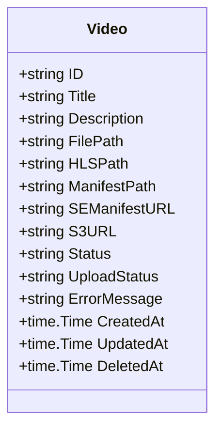
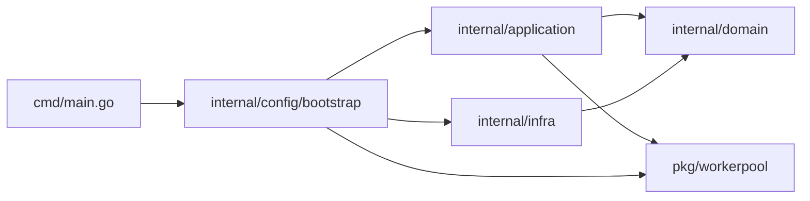

# Arquitetura e Domínio

## Entidade Video



---

## Status do Vídeo

### Status (processamento HLS)

```
pending → processing → completed
                    ↘ failed
```

| Status | Descrição |
|--------|-----------|
| `pending` | Vídeo recebido, aguardando conversão |
| `processing` | Conversão HLS em andamento |
| `completed` | Conversão concluída com sucesso |
| `failed` | Erro durante a conversão |

### UploadStatus (upload para S3)

```
pending_s3 → uploading_s3 → completed_s3
                          ↘ failed_s3
```

| Status | Descrição |
|--------|-----------|
| `pending_s3` | Aguardando início do upload |
| `uploading_s3` | Upload para S3 em andamento |
| `completed_s3` | Upload concluído com sucesso |
| `failed_s3` | Erro durante o upload |

---

## Arquitetura Geral

```mermaid
flowchart TD
    A[API Gin] -->|POST /upload| B[UploadUseCase]
    B -->|Salva arquivo| C[Disco Local]
    B -->|Cria registro| D[(PostgreSQL)]
    B -->|Enfileira job| E[WorkerPool]

    E -->|VideoConversionJob| F[Worker 1]
    E -->|VideoConversionJob| G[Worker 2]
    E -->|VideoConversionJob| H[Worker N]

    F -->|Converte HLS| I[ffmpeg]
    I -->|Gera arquivos| J[uploads/{id}/hls/]
    F -->|Enfileira| K[UploadHLSJob]

    K -->|Upload paralelo| L[S3 LocalStack]
    F -->|Atualiza DB| D

    A -->|GET /videos| M[ListVideosUseCase]
    M -->|Consulta| D
    M -->|Retorna JSON| A
```

---

## Camadas e Dependências



### Regra de dependência (DDD)

- `domain` não depende de nada interno
- `application` depende apenas de `domain` e `pkg`
- `infra` depende de `domain` e implementa as interfaces
- `config` (bootstrap) conhece tudo e monta as peças
- `cmd` apenas chama `config.New()` e `app.Run()`

---

## Worker Pool e Jobs

O worker pool (`pkg/workerpool`) é um primitivo genérico que recebe `Job` e executa com N workers em paralelo.

O factory de jobs (`internal/application/jobs/factory`) registra handlers tipados via **generics**:

```go
factory.Register(jp, func(ctx context.Context, j jobs.VideoConversionJob) workerpool.Result {
    return jobs.ProcessConversion(ctx, ...)
})

factory.Register(jp, func(ctx context.Context, j jobs.UploadHLSJob) workerpool.Result {
    return jobs.ProcessUploadHLS(ctx, ...)
})
```

O `Build()` retorna uma `ProcessorFunc` única que despacha para o handler correto via `reflect.TypeOf`.

### Encadeamento de jobs

Ao finalizar a conversão HLS, o `ProcessConversion` enfileira automaticamente um `UploadHLSJob` no mesmo canal do worker pool, criando um pipeline assíncrono:

```
VideoConversionJob → (após concluir) → UploadHLSJob
```
